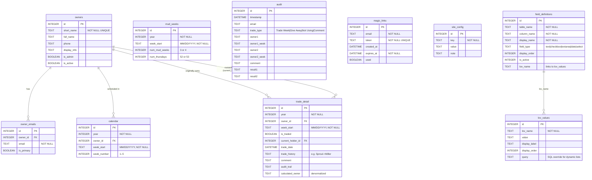

# Snowbound LLC — Data Model

## E/R Diagram

---

## Data Dictionary

### `owners`
The 10 condo owner families.

| Column | Type | Constraints | Description |
|---|---|---|---|
| id | INTEGER | PK | Auto-increment |
| short_name | TEXT | NOT NULL, UNIQUE | "Kamons", "Loyle", etc. |
| full_name | TEXT | | "Larry & Maureen Kamons" |
| phone | TEXT | | Free-form phone number(s) |
| display_info | TEXT | | Full contact block shown on calendar (name, emails, phone) |
| is_admin | BOOLEAN | DEFAULT 0 | 1 = Larry (full admin access) |
| is_active | BOOLEAN | DEFAULT 1 | 0 = soft-deleted |

---

### `owner_emails`
One or more email addresses per owner (used for magic link login).

| Column | Type | Constraints | Description |
|---|---|---|---|
| id | INTEGER | PK | Auto-increment |
| owner_id | INTEGER | FK → owners.id, NOT NULL | Which owner |
| email | TEXT | NOT NULL | Lowercase, trimmed |
| is_primary | BOOLEAN | DEFAULT 0 | Primary contact email |

---

### `calendar`
Master rotation schedule — pre-generated from 2022 to 2100. One row per owner per week.

| Column | Type | Constraints | Description |
|---|---|---|---|
| id | INTEGER | PK | Auto-increment |
| year | INTEGER | NOT NULL | Calendar year |
| owner_id | INTEGER | FK → owners.id, NOT NULL | Owner assigned this week in the rotation |
| week_start | TEXT | NOT NULL | Thursday start date, MM/DD/YYYY |
| week_number | INTEGER | | 1–5, the owner's Nth week in this year |

---

### `mud_weeks`
Skipped weeks in early May each year (condo is not usable). 3 mud weeks in 52-Thursday years, 4 in 53-Thursday years.

| Column | Type | Constraints | Description |
|---|---|---|---|
| id | INTEGER | PK | Auto-increment |
| year | INTEGER | NOT NULL | Calendar year |
| week_start | TEXT | NOT NULL | Thursday start date, MM/DD/YYYY |
| num_mud_weeks | INTEGER | | Total mud weeks this year (3 or 4) |
| num_thursdays | INTEGER | | Total Thursdays this year (52 or 53) |

---

### `trade_detail`
One row per owner-week. Tracks the current state of each week — who originally owns it, who holds it now, and any trade history.

| Column | Type | Constraints | Description |
|---|---|---|---|
| id | INTEGER | PK | Auto-increment |
| year | INTEGER | NOT NULL | Calendar year |
| owner_id | INTEGER | FK → owners.id, NOT NULL | Original rotation owner |
| week_start | TEXT | NOT NULL | Thursday start date, MM/DD/YYYY |
| is_traded | BOOLEAN | DEFAULT 0 | True if week has been traded/given away |
| current_holder_id | INTEGER | FK → owners.id | Who actually has the week now |
| trade_date | DATETIME | | When the trade was recorded |
| trade_history | TEXT | | Chain of trades, e.g. "Sproul->Miller" |
| comment | TEXT | | Free-form note (max 40 chars via form) |
| audit_trail | TEXT | | Full audit string for display |
| calculated_owner | TEXT | | Denormalized display name of current holder |

---

### `audit`
Log of every form submission (trades, give-aways, comments).

| Column | Type | Constraints | Description |
|---|---|---|---|
| id | INTEGER | PK | Auto-increment |
| timestamp | DATETIME | DEFAULT CURRENT_TIMESTAMP | When submitted |
| email | TEXT | | Who submitted |
| trade_type | TEXT | | "Trade Week", "Give Away", "Not Using", "Comment" |
| owner1 | TEXT | | Initiating owner's short name |
| owner1_week | TEXT | | Initiating owner's week (MM/DD/YYYY) |
| owner2 | TEXT | | Receiving owner's short name (nullable) |
| owner2_week | TEXT | | Receiving owner's week (nullable) |
| comment | TEXT | | Free-form comment |
| result1 | TEXT | | Audit record for first side of trade |
| result2 | TEXT | | Audit record for second side of trade |

---

### `magic_links`
Single-use login tokens emailed to owners. Expire after 15 minutes.

| Column | Type | Constraints | Description |
|---|---|---|---|
| id | INTEGER | PK | Auto-increment |
| email | TEXT | NOT NULL | Address the link was sent to |
| token | TEXT | NOT NULL, UNIQUE | Random URL-safe token |
| created_at | DATETIME | DEFAULT CURRENT_TIMESTAMP | When generated |
| expires_at | DATETIME | NOT NULL | created_at + 15 minutes |
| used | BOOLEAN | DEFAULT 0 | One-time use; set to 1 on first click |

---

### `site_config`
Editable property info shown on the calendar header. Managed by Larry via the admin table browser.

| Column | Type | Constraints | Description |
|---|---|---|---|
| id | INTEGER | PK | Auto-increment |
| key | TEXT | NOT NULL | "Garage", "WiFi", "Lock Box" |
| value | TEXT | | The code/password, e.g. "2071" |
| note | TEXT | | Neighbor contact info shown alongside the value |

---

### `field_definitions`
Configuration for the Generic Table Browser — controls display names, field types, column ordering, and visibility.

| Column | Type | Constraints | Description |
|---|---|---|---|
| id | INTEGER | PK | Auto-increment |
| table_name | TEXT | NOT NULL | Which table this row configures |
| column_name | TEXT | NOT NULL | Which column |
| display_name | TEXT | NOT NULL | Human-readable column header |
| field_type | TEXT | DEFAULT 'text' | text, checkbox, textarea, date, select |
| display_order | INTEGER | DEFAULT 0 | Column sort order in the browser |
| is_active | INTEGER | DEFAULT 1 | 0 = hide this column |
| lov_name | TEXT | DEFAULT '' | Links to lov_values for select dropdowns |

---

### `lov_values`
Static or dynamic dropdown options for select fields in the Generic Table Browser.

| Column | Type | Constraints | Description |
|---|---|---|---|
| id | INTEGER | PK | Auto-increment |
| lov_name | TEXT | NOT NULL | Matches field_definitions.lov_name |
| value | TEXT | DEFAULT '' | Stored value |
| display_label | TEXT | DEFAULT '' | Shown to user |
| display_order | INTEGER | DEFAULT 0 | Sort order |
| query | TEXT | DEFAULT '' | If populated, execute this SQL instead of static rows |

---

## Foreign Key Summary

| Table | Column | References |
|---|---|---|
| owner_emails | owner_id | owners.id |
| calendar | owner_id | owners.id |
| trade_detail | owner_id | owners.id |
| trade_detail | current_holder_id | owners.id |
| field_definitions | lov_name | lov_values.lov_name *(soft — no DB constraint)* |

---

## Views (auto-generated at startup)

| View | Description |
|---|---|
| v_previous_year | trade_detail rows for current year − 1 |
| v_current_year | trade_detail rows for current year |
| v_next_year | trade_detail rows for current year + 1 |
